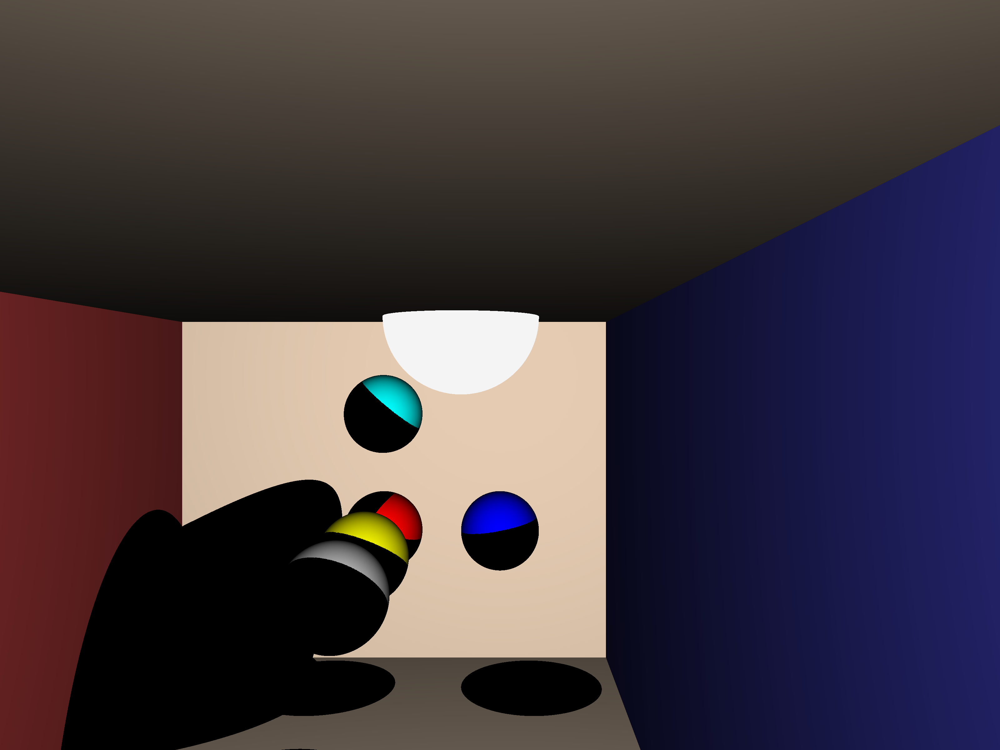

# simd-tracer
SIMD-based ray/path tracing experiments.

Some parts inspired or based on scratchapixel.com. Other parts derived from github.com/eriklupander/pathtracer and/or the "Ray tracer challenge" book.

